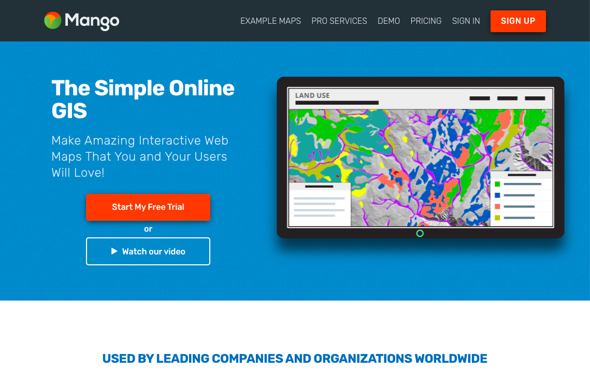

# Mango Map

https://mangomap.com/

This site's agenda is stated to help users create personalized and integrated web maps that are easy to use and insightful. They prioritize customizability as well. The maps created through Mango Map also allow for insights and show patterns. They are also available on all devices and are easily integrated. 

This website speaks to me in particular because it seems to be designed to be accessible for all. Specifically, it does not require any coding to create a map which allows for any company or individual to use it without much prior knowledge. They also are very vocal about their privacy policies and that it is important to them to keep your data safe, which as a user I appreciate. They describe themselves as user-friendly which is also useful as a new GIS user. I also appreciate how customizable the design elements are, as they provide you with recommendations but all colors, lines, etc. can be changed by the user.

After trying their site, I found that it was very functional and was very easy to understand. The map building aspects were also very intuitive. They offer many example maps for a variety of industries as well to indicate how you could use their site to best fit your needs. They also offer paid services that will have one of their employees help set-up your account, walk you through the features, and any other kind of support you need.

Mango uses a large amount of open source technology to build their maps and site. They use GDAL, PostGIS, GeoServer, and Leaflet. Each of these parts contribute a different aspect to the mapping. Leaflet was a later addition as they originally had built their own JavaScript web-mapping library, however they converted when it was released.

If I could change one aspect of Mango Map, I would want them to provide a free version for people who cannot afford their steep pricing, like students. They clearly aim to be a very accessible site and do offer a 30 day free trial, however to truly be usable by all, it is imperative that they provide free services in my opinion. Their paid services are also limiting as for their lowest paid level, you can only make 10 maps a year, but I think this allows for a free version where you can make up to 5 maps, for example.
